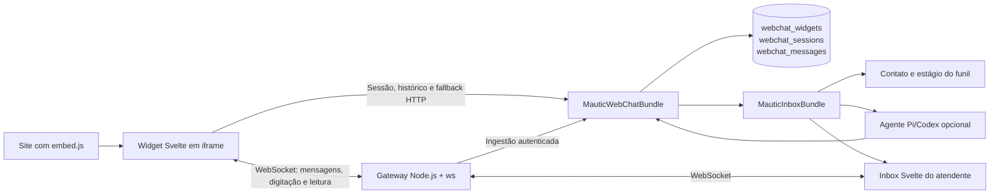

# Mautic Realtime Web Chat

Canal de chat incorporável para o [Mautic Omnichannel Inbox](https://github.com/raphaelcangucu/mautic-inbox-bundle). O visitante conversa no site em tempo real e a equipe recebe a conversa no mesmo Inbox usado por WhatsApp, Instagram e Facebook. O canal preserva atribuição humana, notas internas, respostas prontas, estágio do contato e agentes de IA executados pelo Pi/Codex.


## O que a versão 1.0 entrega

- widget responsivo e isolado em `iframe`, instalado por uma única tag `script`;
- sessão retomável, histórico durável e identificação opcional por nome e e-mail;
- WebSocket autenticado com presença e indicadores de digitação dos dois lados;
- confirmações de entrega e leitura para visitante e atendente;
- entrada no Inbox com canal, página de origem, referência e UTMs;
- atendimento humano, transferência, notas, encerramento e respostas prontas;
- atribuição automática opcional a um agente de IA configurado no Inbox;
- agente identificado pelo nome durante digitação e respostas;
- criação ou vínculo do contato Mautic para uso do estágio do funil;
- configuração visual, lista de domínios permitidos, conta de apoio e página de demonstração;
- recuperação por HTTP quando o WebSocket estiver momentaneamente indisponível.

## Fluxo

1. A página carrega `/chat/embed.js?id=pub_...`.
2. O loader cria um `iframe` isolado, validado contra a lista de origens do widget.
3. O visitante inicia ou retoma uma sessão. Nome e e-mail podem vincular um contato do Mautic.
4. Cada mensagem é persistida antes de ser publicada no WebSocket.
5. O `MauticWebChatBundle` entrega o evento ao `MauticInboxBundle` pelo contrato `ChannelTransportInterface`.
6. Atendente e visitante recebem mensagens, digitação, entrega e leitura em tempo real.
7. Se configurado, o Inbox transfere a conversa ao agente Pi/Codex, que usa o mesmo transporte para responder.
8. O humano ou o agente resolve a conversa; uma nova mensagem do visitante pode reabri-la.



O Web Chat mantém widgets, sessões e mensagens próprias. Para conservar compatibilidade com o atendimento já existente, ele usa a conversa durável do conector Meta como envelope do Inbox. A extensão `ChannelTransportInterface`, disponível desde o Inbox 1.3, delega envio, leitura, digitação e metadados ao canal Web Chat sem mudar o comportamento dos canais Meta.

Veja a arquitetura detalhada em [docs/ARCHITECTURE.md](docs/ARCHITECTURE.md) e o guia de operação em [docs/OPERATIONS.md](docs/OPERATIONS.md).

## Dependências

- PHP 8.2 ou superior;
- Mautic 7;
- `raphaelcangucu/mautic-meta-bundle` 0.14 ou superior;
- `raphaelcangucu/mautic-inbox-bundle` 1.3 ou superior;
- Node.js 20 ou superior para o gateway em produção;
- Nginx ou outro proxy reverso com upgrade WebSocket;
- PM2, systemd ou outro supervisor para manter o gateway ativo.

O frontend usa Svelte 5 e TypeScript. Os bundles compilados ficam em `Assets/dist`, portanto o servidor de produção só precisa de Node.js para o gateway; Vite não é executado a cada requisição.

## Instalação

Instale o bundle em `plugins/MauticWebChatBundle`, instale as dependências do gateway e compile os frontends:

```bash
composer require raphaelcangucu/mautic-webchat-bundle
cd plugins/MauticWebChatBundle
npm ci
npm run build
npm --prefix Realtime ci --omit=dev
php ../../bin/console mautic:plugins:reload --env=prod
```

O reload registra `webchat_widgets`, `webchat_sessions` e `webchat_messages`. Em produção, faça backup e confira o banco selecionado antes de registrar ou atualizar o plugin.

Defina variáveis exclusivas do Web Chat. O segredo deve conter pelo menos 32 caracteres e ser idêntico no PHP e no processo Node:

```dotenv
MAUTIC_WEBCHAT_REALTIME_SECRET=troque-por-um-segredo-aleatorio-longo
MAUTIC_WEBCHAT_REALTIME_URL=wss://mautic.exemplo.com/chat/realtime
MAUTIC_WEBCHAT_REALTIME_INTERNAL_URL=http://127.0.0.1:8790
MAUTIC_WEBCHAT_INGEST_URL=https://mautic.exemplo.com/chat/api/realtime/ingest
WEBCHAT_HOST=127.0.0.1
WEBCHAT_PORT=8790
```

O diretório `Realtime` contém o processo PM2. Carregue as variáveis no ambiente antes de iniciar:

```bash
pm2 start Realtime/ecosystem.config.cjs --update-env
pm2 save
curl -fsS http://127.0.0.1:8790/health
```

Adicione o proxy e o cache público descritos em [`docs/nginx.conf.example`](docs/nginx.conf.example), execute `nginx -t` e recarregue o Nginx.

Abra **Web Chat** no menu do Mautic, crie um widget, selecione a conta usada pelo Inbox, autorize os domínios e copie a tag gerada:

```html
<script async src="https://mautic.exemplo.com/chat/embed.js?id=pub_EXEMPLO"></script>
```

`/chat/generate.js` permanece como alias de compatibilidade. Use `/chat/embed.js` em novas instalações para evitar bloqueadores que classificam nomes genéricos como scripts de anúncios.

## Integração com o Inbox e a IA

O plugin não duplica a lógica de atendimento. A conversa aparece com o badge **Web Chat** e pode ser assumida, transferida, adiada ou resolvida no Inbox. Mensagens humanas e da IA passam pelo mesmo transporte; notas internas não chegam ao visitante.

Quando o widget possui um agente inicial:

- a sessão é atribuída ao agente habilitado para a conta e para o canal Web Chat;
- o indicador exibe o nome do agente enquanto o Pi executa;
- documentos publicados, CMS, mercados permitidos e estágio do funil vêm da configuração do Inbox;
- `0` mantém respostas ilimitadas; um limite positivo pausa a sessão ao ser atingido;
- o agente pode encerrar a conversa, registrando **Closed by agent** no Inbox.


## Segurança e privacidade

- cada widget aceita somente origens HTTPS cadastradas;
- o `iframe` recebe uma CSP `frame-ancestors` restrita aos domínios do widget;
- visitante e atendente usam tokens HMAC diferentes, vinculados à sessão e com expiração;
- o segredo interno do gateway nunca é enviado ao navegador;
- mensagens são persistidas antes da publicação em tempo real;
- o gateway escuta em `127.0.0.1` por padrão e limita payloads a 64 KiB;
- nome e e-mail podem criar ou vincular um contato, de acordo com a configuração do widget;
- endpoints públicos são stateless e não inicializam a sessão administrativa do Mautic;
- o loader e o HTML público podem receber cache curto no proxy sem armazenar APIs de sessão.

## Desenvolvimento e testes

Os testes abaixo não iniciam o kernel do Mautic nem alteram banco de dados:

```bash
npm ci
npm test
find . -path './node_modules' -prune -o -path './vendor' -prune -o -name '*.php' -print0 \
  | xargs -0 -n1 php -l
composer validate --strict
```

`npm test` verifica Svelte/TypeScript, produz os bundles, testa o protocolo do cliente e inicia o gateway numa porta efêmera para comprovar autenticação, digitação, ingestão e publicação. Testes de navegador devem usar uma conversa autorizada e confirmar visualmente os estados no widget e no Inbox.

## Demonstração end-to-end

[](docs/video/mautic-webchat-e2e.mp4)

[Assistir ao vídeo MP4 da validação da versão 1.0](docs/video/mautic-webchat-e2e.mp4)

O roteiro registrado cobre configuração, início da sessão, identificação, digitação do visitante, digitação nomeada da IA, confirmação de leitura, consulta do relatório da rodada, resposta contextual, limite ilimitado e encerramento pelo agente.

| Visitante digitando no Inbox | Agente digitando no site |
| --- | --- |
|  |  |

| Confirmação de leitura | Resposta contextual no Inbox |
| --- | --- |
|  |  |

## Operação

- `GET /s/webchat/api/realtime/health` mostra a configuração e a saúde do gateway para administradores;
- `GET http://127.0.0.1:8790/health` mostra salas, conexões e uptime localmente;
- mensagens continuam disponíveis pelo histórico HTTP quando o gateway cai;
- desativar um widget impede novas sessões e preserva conversas existentes;
- a demonstração de cada widget fica em `/chat/demo/{publicKey}`.

## Licença

[GPL-3.0-or-later](LICENSE).
