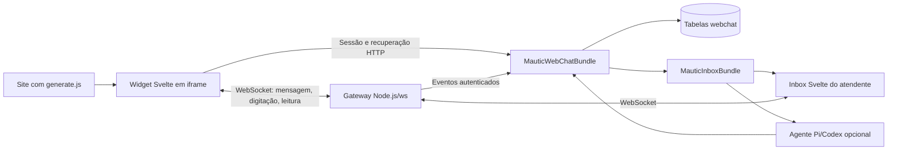

# Mautic Realtime Web Chat

Canal de chat incorporável para o [Mautic Omnichannel Inbox](https://github.com/raphaelcangucu/mautic-inbox-bundle). O visitante conversa no site em tempo real; a equipe recebe a conversa no mesmo Inbox usado por WhatsApp, Instagram e Facebook. O canal preserva atribuição humana, notas internas, respostas prontas, funil do contato e agentes de IA do Inbox.


## O que a versão 1.0 entrega

- widget responsivo e isolado em `iframe`, instalado por uma única tag `script`;
- sessão retomável, histórico durável e identificação opcional por nome e e-mail;
- WebSocket autenticado com tokens de sessão, indicador de digitação e presença;
- confirmações de entrega e leitura nas duas pontas;
- entrada no Inbox com canal, página de origem, referência e UTMs;
- atendimento humano, transferência, notas, encerramento e respostas prontas;
- atribuição automática opcional a um agente de IA já configurado no Inbox;
- configuração visual, lista de domínios permitidos, conta de apoio e demonstração;
- recuperação por HTTP quando o WebSocket estiver momentaneamente indisponível.

## Arquitetura



O plugin mantém as sessões e mensagens próprias e usa a conversa durável do conector Meta como envelope compatível com o Inbox. A extensão `ChannelTransportInterface`, introduzida no Inbox 1.3, delega envio, leitura e metadados ao canal Web Chat sem alterar o comportamento dos canais Meta existentes.

## Dependências

- PHP 8.2 ou superior;
- Mautic 7;
- `raphaelcangucu/mautic-meta-bundle` 0.14 ou superior;
- `raphaelcangucu/mautic-inbox-bundle` 1.3 ou superior;
- Node.js 20 ou superior no servidor do gateway;
- proxy reverso com suporte a upgrade WebSocket.

## Instalação

Instale o bundle em `plugins/MauticWebChatBundle`, instale as dependências do gateway e compile os dois frontends:

```bash
composer require raphaelcangucu/mautic-webchat-bundle
cd plugins/MauticWebChatBundle
npm ci
npm run build
npm --prefix Realtime ci --omit=dev
php ../../bin/console mautic:plugins:reload --env=prod
```

Defina variáveis exclusivas do Web Chat. O segredo deve conter pelo menos 32 caracteres e deve ser igual no PHP e no processo Node:

```dotenv
MAUTIC_WEBCHAT_REALTIME_SECRET=troque-por-um-segredo-aleatorio-longo
MAUTIC_WEBCHAT_REALTIME_URL=wss://mautic.exemplo.com/chat/realtime
MAUTIC_WEBCHAT_REALTIME_INTERNAL_URL=http://127.0.0.1:8790
MAUTIC_WEBCHAT_INGEST_URL=https://mautic.exemplo.com/chat/api/realtime/ingest
WEBCHAT_HOST=127.0.0.1
WEBCHAT_PORT=8790
```

O diretório `Realtime` contém um arquivo de processo para PM2. Carregue as variáveis acima no ambiente do processo antes de iniciar:

```bash
pm2 start Realtime/ecosystem.config.cjs --update-env
pm2 save
```

Adicione o proxy descrito em [`docs/nginx.conf.example`](docs/nginx.conf.example), valide a configuração do Nginx e recarregue o serviço.

Abra **Web Chat** no menu do Mautic, crie um widget, selecione a conta usada pelo Inbox, autorize os domínios e copie a tag gerada para o site:

```html
<script async src="https://mautic.exemplo.com/chat/generate.js?id=pub_EXEMPLO"></script>
```

## Segurança e dados

- cada widget aceita somente origens HTTPS presentes na lista configurada;
- o `iframe` recebe uma política CSP `frame-ancestors` restrita aos domínios do widget;
- visitante e atendente usam tokens HMAC distintos, vinculados à sessão e com expiração;
- o segredo interno do gateway nunca é enviado ao navegador;
- mensagens aceitas ficam no banco antes da publicação em tempo real;
- o gateway escuta em `127.0.0.1` por padrão e limita payloads a 64 KiB;
- nome e e-mail podem criar ou vincular um contato Mautic, permitindo leitura de estágio do funil pelo agente.

## Desenvolvimento e validação

Os testes abaixo são estáticos e de processo; não iniciam o kernel do Mautic nem alteram banco de dados:

```bash
npm test
find . -name '*.php' -print0 | xargs -0 -n1 php -l
composer validate --no-check-publish
```

`npm test` compila as interfaces Svelte, valida os tipos, testa o protocolo do cliente e inicia o gateway numa porta efêmera para comprovar autenticação, digitação, ingestão e publicação.

## Operação

- `GET /s/webchat/api/realtime/health` informa configuração e saúde do gateway para administradores;
- `GET http://127.0.0.1:8790/health` informa salas, conexões e uptime localmente;
- mensagens continuam disponíveis pelo histórico HTTP quando o gateway cai;
- desativar um widget impede novas sessões e preserva conversas existentes.

## Licença

GPL-3.0-or-later.
